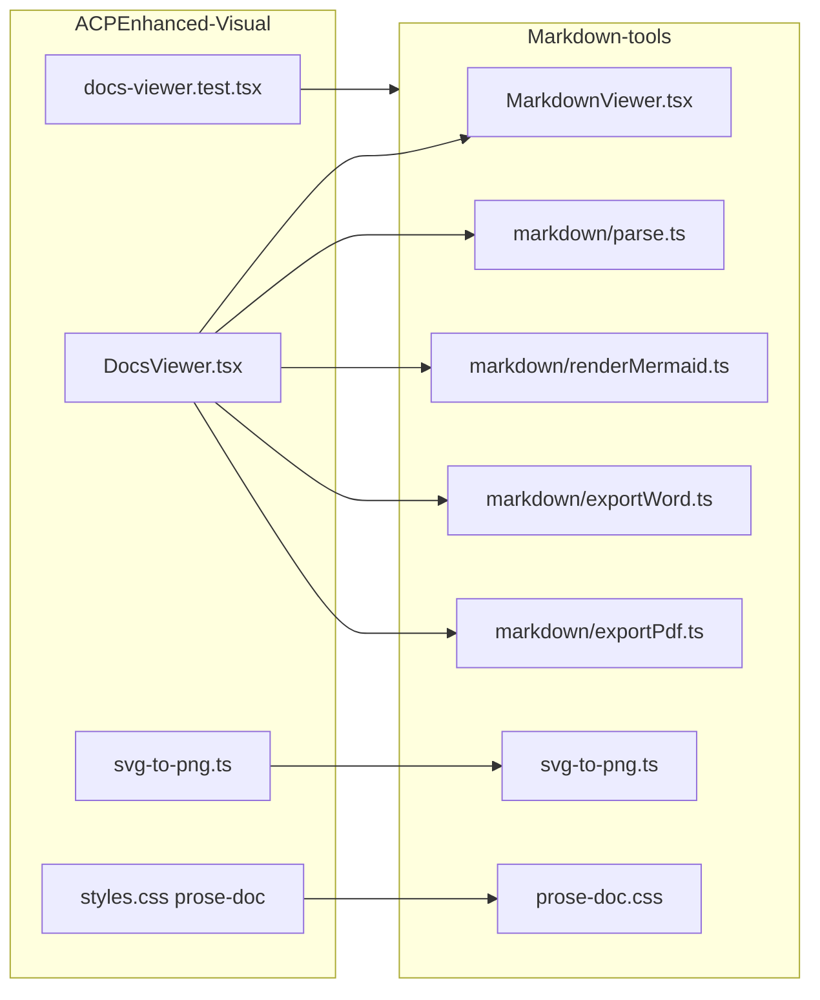

# Product Requirements Document — Markdown-tools

**Project Name**: Markdown-tools  
**Created**: 2026-06-14  
**Status**: Active  
**Version**: 1.7.0  
**Author**: Product / Engineering (ACP session)  
**Last reviewed**: 2026-06-14 (post-M7 sync — E2E, run/install docs)  
**Planning**: [agent/progress.yaml](../progress.yaml) · M1–M7 · 60 tasks · [architecture.md](architecture.md)

---

## Overview

**Markdown-tools** is a desktop-first web application for viewing, navigating, and exporting Markdown documents. Users open files via drag-and-drop, file picker, or folder browser; read richly rendered content (Mermaid diagrams, KaTeX math); and export to Word (`.doc`), DOCX, or PDF — all client-side.

The product also ships as **`@markdown-tools/react`** for embedding in ACPEnhanced-Visual and third-party React apps. A **Tauri 2** desktop build provides native file associations and offline install.

The product reuses proven viewer components from **ACPEnhanced-Visual** (`C:\Project\ACP\ACPEnhanced-Visual`, package `acp-visualizer` v1.5.4) while stripping ACP progress-dashboard coupling and focusing on a standalone markdown workflow.

**Target users**: technical writers, developers, product managers, and teams who work with `.md` files and need reliable preview + export without installing Pandoc or a full IDE.

---

## Problem Statement

Markdown is the lingua franca of technical documentation, but native OS viewers and basic browser previews are inadequate:

- **No drag-and-drop** — users must open files through file dialogs or CLI tools.
- **Weak diagram support** — Mermaid blocks often fail to render or export correctly.
- **Poor export fidelity** — copy-paste to Word loses headings, tables, and diagrams; PDF workflows require Pandoc/LaTeX expertise.
- **Fragmented tooling** — separate apps for preview, export, and diagram editing.

Teams need a single, fast viewer that matches modern documentation UX (GitHub, Docusaurus, Notion-export quality) with one-click Word/PDF export.

---

## Goals and Objectives

### Primary Goals

1. **Best-in-class Markdown viewing** — GFM rendering, TOC, syntax highlighting, responsive tables, dark/light themes.
2. **Sophisticated Mermaid viewer** — reliable render, loading/error states, click-to-zoom, theme sync, export fidelity.
3. **Drag-and-drop first** — drop `.md` files onto the app for instant preview without server setup.
4. **Export to Word and PDF** — share documents with stakeholders who do not use Markdown tooling.
5. **Reuse ACPEnhanced-Visual** — port `DocsViewer`, `svg-to-png`, and prose styles; avoid rebuilding from scratch.
6. **Shared viewer for acp-visualizer** — publish `@markdown-tools/react` so ACPEnhanced-Visual embeds the same component instead of maintaining duplicate `DocsViewer.tsx` (ADR-006, M6).

### Secondary Goals

1. Optional folder browser for project-local `.md` files — ✅ M4 (FSA + webkitdirectory fallback).
2. Offline-capable client bundle (no cloud upload of document content) — ✅.
3. ACP Enhanced integration — `/acp-visualize` can still launch the full visualizer when progress tracking is needed.
4. ~~Future: true `.docx` export, CLI entry point, native desktop wrapper (Tauri)~~ — ✅ M4–M5 (v0.4.0); publish-ready library M6; audit remediation M7.

### Success Metrics (MVP)

| Metric | Target |
|--------|--------|
| Time to first render after drop | < 500 ms for files ≤ 500 KB |
| Mermaid render success rate | ≥ 95% of valid diagrams (with visible fallback on failure) |
| Export completion | Word + PDF flows complete without console errors for standard test docs |
| Lighthouse Performance (SPA) | ≥ 85 on local build |
| Unit test coverage (viewer core) | ≥ 60% lines on markdown pipeline |

---

## Source Audit — ACPEnhanced-Visual

### What to reuse (Tier 1 — direct port)

| Source path | Role | Notes |
|-------------|------|-------|
| `src/components/DocsViewer.tsx` | Viewer shell, parse pipeline, export, DnD, Mermaid | ~610 lines; split during port |
| `src/lib/svg-to-png.ts` | SVG → PNG for Word/PDF export | Canvas-based, 154 lines |
| `src/styles.css` (`.prose-doc`, mermaid, print) | Typography + diagram styling | Extract lines ~18–317 |
| `test/components/docs-viewer.test.tsx` | Component tests | Extend for export + DnD |

### What to adapt (Tier 2)

| Source path | Adaptation |
|-------------|------------|
| `server/routes/api/docs.ts` | Generalize `DOC_DIRS` → configurable roots (`docs/`, user folder); optional for MVP |
| `src/routes/docs.tsx` | Route wrapper → `/` or `/view` in new app |

### What NOT to port (ACP-specific)

- Progress dashboard (`MilestoneTable`, `useProgressData`, aggregate home)
- ACP **multi-project** tab bar (progress dashboard), `bin/acp-visualizer.mjs`, `PROGRESS_YAML_PATH` coupling — **not** the same as M9 multi-**document** tabs in markdown-tools
- GitHub fetch, memory-files, and other ACP server routes

### Known gaps in source (address in Markdown-tools)

| Gap | Current state | PRD requirement |
|-----|---------------|-----------------|
| Syntax highlighting | `lowlight`/`rehype-highlight` in deps but **unused** | ✅ **Implemented** — `highlight.ts` + lowlight (M2) |
| Word export | HTML blob as `.doc` + true `.docx` via `docx` library | ✅ **Implemented** — M4 + M7 parity |
| PDF export | Browser print dialog | ✅ MVP; programmatic PDF deferred |
| Mermaid UX | Zoom, pan, copy source, download SVG | ✅ M3b pan + M4 copy/download |
| XSS surface | `dangerouslySetInnerHTML` + inline `onclick` | Sanitize untrusted MD; React event delegation for copy |
| Monolithic component | Single 610-line file | Refactor into `src/markdown/*` modules |

### Rendering pipeline (preserved from source)

```
Markdown string
  → preprocessMath()          # KaTeX placeholders (fenced code protected)
  → marked({ breaks: true, gfm: true })
  → extractMermaid()          # fences → .mermaid-container
  → enhanceCodeBlocks()       # language badge + copy (after mermaid)
  → applySyntaxHighlighting() # lowlight
  → wrapTables()
  → addAnchors()              # h1–h3 IDs + TOC (deduped ids — FR-8.8)
  → DOMPurify.sanitize()      # XSS hardening (M3)
  → restoreMath()             # KaTeX HTML placeholders
  → dangerouslySetInnerHTML on .prose-doc
  → renderMermaid()           # dynamic import, retry, theme sync
```

Code copy uses `encodeDataAttribute` / `decodeDataAttribute` (`html-entities.ts`) — no inline `onclick` (M3b).

---

## Competitive Research — What a Good Markdown Viewer Needs

Research synthesized from MarkView (2026), OmniCore Markdown Viewer, Rendu, Pandoc/Word export guides, and ACPEnhanced-Visual milestones M37/M39.

### Table stakes (MVP — industry expectation)

| Category | Requirement | Source benchmark |
|----------|-------------|----------------|
| **Input** | Drag-and-drop `.md` files | Rendu, MarkView, ACPEnhanced-Visual |
| **Input** | Open file / open folder from UI | Rendu, OmniCore |
| **Rendering** | GitHub-Flavored Markdown (tables, task lists, strikethrough, autolinks) | All competitors |
| **Rendering** | Syntax-highlighted code blocks with language label | MarkView (180+ langs), M37 spec |
| **Rendering** | Responsive tables with horizontal scroll | ACPEnhanced-Visual, OmniCore |
| **Navigation** | Document outline / TOC with click-to-jump | Rendu, MarkView, M37 |
| **Navigation** | Active section highlight on scroll | ACPEnhanced-Visual (IntersectionObserver) |
| **Navigation** | Heading anchor links (copy link to section) | GitHub parity, M37 |
| **Reading UX** | Dark / light theme toggle | Universal |
| **Reading UX** | Font size control (S / M / L) | ACPEnhanced-Visual |
| **Reading UX** | Fullscreen / distraction-free mode | ACPEnhanced-Visual |
| **Reading UX** | Image lightbox on click | ACPEnhanced-Visual |
| **Reading UX** | Code block one-click copy | GitHub, M37 |
| **Diagrams** | Mermaid: flowchart, sequence, class, state, ER, Gantt | MarkView, OmniCore |
| **Diagrams** | Loading indicator while rendering | M39 spec |
| **Diagrams** | Graceful error fallback (show source + message) | M39 spec |
| **Diagrams** | Click-to-zoom lightbox | ACPEnhanced-Visual (implemented) |
| **Export** | Export to Word with headings, tables, code blocks preserved | MarkView, Unmarkdown, M39 |
| **Export** | Export to PDF (print-optimized layout) | Rendu, MarkView |
| **Export** | Mermaid embedded in exports (not broken placeholders) | M39 — SVG→PNG in Word | 
| **Privacy** | Client-side processing; no upload of file content to server | MarkView, Rendu |
| **Performance** | Debounced re-render; avoid destroying Mermaid SVG on unrelated state updates | ACPEnhanced-Visual `innerHtml` memo pattern |

### Differentiators (Phase 1b / Phase 2)

| Category | Requirement | Rationale |
|----------|-------------|-----------|
| **Diagrams** | Pan/zoom in Mermaid lightbox | OmniCore, M39 task-210 |
| **Diagrams** | Copy Mermaid source / download SVG | M39 task-210 |
| **Diagrams** | Large diagram guard (>500 KB SVG) — scrollable container | M39 |
| **Export** | True `.docx` with Word heading styles (H1–H6) | Unmarkdown, Pandoc reference-docx |
| **Export** | LaTeX/math rendering in preview + export | MarkView (KaTeX → OMML) |
| **Tables** | Interactive sort/filter (optional) | OmniCore (Tabulator) |
| **Editor** | Split-view live edit + preview | **Deferred to Phase 3** — view-only through Phase 2 |
| **Productivity** | Word count + reading time | MarkView |
| **Productivity** | Reading progress bar | MarkView |
| **Accessibility** | Keyboard navigation for TOC, focus traps in lightbox | WCAG 2.1 AA target |
| **i18n** | UI strings externalized | Rendu multi-language |
| **CLI** | `markdown-tools open file.md` | Rendu pattern |

### Export quality bar (from Word/PDF research)

Word export must preserve:

1. **Real heading hierarchy** — not just larger font sizes (Word styles or semantic HTML headings).
2. **Native tables** — borders, header row, no broken layout in Word.
3. **Monospace code blocks** — background + preserved line breaks.
4. **Nested lists** — correct indentation.
5. **Diagrams** — rasterized PNG fallback when SVG embedding fails (existing `svg-to-png.ts`).

PDF export must preserve:

1. Page-break rules on headings and tables (`page-break-inside: avoid`).
2. Print margins suitable for A4/Letter.
3. Diagrams included (PNG or inline SVG where supported).

---

## Functional Requirements

### FR-1 — Document input

| ID | Requirement | Priority | Source |
|----|-------------|----------|--------|
| FR-1.1 | Accept `.md` files via drag-and-drop on main viewer area | P0 | DocsViewer |
| FR-1.2 | Show visual drop overlay while dragging | P0 | DocsViewer |
| FR-1.3 | Reject non-`.md` drops with user-visible feedback | P1 | DocsViewer |
| FR-1.4 | Open single file via file picker | P1 | New |
| FR-1.5 | Optional: browse folder tree for `.md` files | P2 | `docs.ts` pattern |
| FR-1.6 | Remember last opened file path in session (not persisted cross-session unless P2) | P2 | New |

### FR-2 — Markdown rendering

| ID | Requirement | Priority | Source |
|----|-------------|----------|--------|
| FR-2.1 | Parse with GFM (`marked`: breaks, gfm) | P0 | DocsViewer |
| FR-2.2 | Syntax highlighting for ≥10 languages (js, ts, bash, yaml, json, md, css, html, python, sql) | P0 | M37 (gap in source) |
| FR-2.3 | Wrap tables in horizontal scroll container | P0 | DocsViewer |
| FR-2.4 | Blockquotes, lists, images, links rendered per `.prose-doc` styles | P0 | styles.css |
| FR-2.5 | Sanitize HTML if untrusted user content is in scope | P1 | Security |
| FR-2.6 | Task list checkboxes (GFM) render correctly | P1 | GFM |
| FR-2.7 | Strikethrough, autolinks | P1 | GFM |

### FR-3 — Navigation & reading UX

| ID | Requirement | Priority | Source |
|----|-------------|----------|--------|
| FR-3.1 | Auto-generated TOC from h1–h3 | P0 | DocsViewer |
| FR-3.2 | TOC click scrolls to section | P0 | DocsViewer |
| FR-3.3 | Active TOC entry follows scroll (IntersectionObserver) | P0 | DocsViewer |
| FR-3.4 | Heading anchor links on hover | P1 | M37 |
| FR-3.5 | Dark / light theme toggle | P0 | DocsViewer |
| FR-3.6 | Font size S / M / L | P0 | DocsViewer |
| FR-3.7 | Fullscreen mode (hide sidebars/chrome) | P1 | DocsViewer |
| FR-3.8 | Image click opens lightbox | P1 | DocsViewer |
| FR-3.9 | Code block copy button with “Copied!” feedback | P0 | DocsViewer |

### FR-4 — Mermaid diagram viewer

| ID | Requirement | Priority | Source |
|----|-------------|----------|--------|
| FR-4.1 | Detect ` ```mermaid ` fences and render as SVG | P0 | DocsViewer |
| FR-4.2 | `securityLevel: 'loose'` for full diagram type support | P0 | M39 |
| FR-4.3 | Loading state: “Rendering diagram…” | P0 | DocsViewer |
| FR-4.4 | Per-diagram error fallback with source code | P0 | DocsViewer |
| FR-4.5 | Dynamic `import('mermaid')` with timeout + retry (≤5) | P0 | DocsViewer |
| FR-4.6 | Re-render all diagrams on theme change | P0 | DocsViewer |
| FR-4.7 | Click diagram → zoom lightbox | P0 | DocsViewer |
| FR-4.8 | Pan in zoom lightbox | P2 | M39 task-210 |
| FR-4.9 | Copy Mermaid source / download SVG | P2 | M39 task-210 |
| FR-4.10 | Large SVG scroll/zoom container (>500 KB) | P2 | M39 |

### FR-5 — Export

| ID | Requirement | Priority | Source |
|----|-------------|----------|--------|
| FR-5.1 | Export to Word (`.doc` HTML blob — labeled “Word (.doc)” in UI) | P0 | `exportWord` + native/browser save |
| FR-5.2 | Mermaid → PNG in Word export via `svg-to-png.ts` | P0 | DocsViewer |
| FR-5.3 | Export to PDF via print-optimized HTML + system print dialog | P0 | Browser: hidden iframe `print()`; Tauri: `print_html_document` Rust command |
| FR-5.4 | Toast feedback during export; clear errors when save/print fails | P0 | `toastForSaveResult` / save dialog before async prep |
| FR-5.5 | Strip UI chrome (copy buttons, anchors) from export DOM | P0 | DocsViewer |
| FR-5.6 | True `.docx` with Word styles | P2 | ✅ `exportDocx.ts` |
| FR-5.7 | Programmatic PDF (no print dialog) | P3 | Research |

### FR-6 — Application shell

| ID | Requirement | Priority | Source |
|----|-------------|----------|--------|
| FR-6.1 | Single-page app with viewer as primary route | P0 | New |
| FR-6.2 | Empty state: “Drop a Markdown file here” | P0 | DocsViewer |
| FR-6.3 | Toolbar: theme, font, fullscreen, export buttons | P0 | DocsViewer |
| FR-6.4 | Error boundary for render failures | P1 | ErrorBoundary pattern |

### FR-7 — Embeddable library (ACPEnhanced-Visual integration)

| ID | Requirement | Priority | Phase |
|----|-------------|----------|-------|
| FR-7.1 | Publish `@markdown-tools/react` with Vite library build and `package.json` exports | P1 | M6 |
| FR-7.2 | `MarkdownViewer` accepts controlled props: `content`, `files`, `onSelectFile`, `documentPath`, `loading` | P1 | M6 |
| FR-7.3 | No server-side `listDocs` / `readDoc` inside package — consumer injects data | P1 | M6 |
| FR-7.4 | Deep-link props `initialFile`, `initialAnchor` for `SourceLink` (`?file=&anchor=`) parity | P1 | M6 |
| FR-7.5 | Optional `showSidebar`, `theme` for embed in TanStack Start shell | P2 | M6 |
| FR-7.6 | Export `DocFile` TypeScript type matching visualizer `docs.ts` shape | P1 | M6 |
| FR-7.7 | Documented CSS import path and `peerDependencies` (react, react-dom) | P1 | M6 |
| FR-7.8 | ACPEnhanced-Visual migration: replace `DocsViewer` import; delete duplicated viewer | P1 | M6 |
| FR-7.9 | `onThemeChange` callback when `theme` prop controlled (ADR-007) | P1 | M3b |

**Server adapter note**: Visualizer uses **server** `listDocs` / `readDoc` (not client File System Access API). M4 task-20 folder browser is standalone-only; embed consumers use injected props (FR-7.2–7.3).

### FR-8 — Quality gates (audit remediation)

| ID | Requirement | Priority | Phase |
|----|-------------|----------|-------|
| FR-8.1 | ≥60% unit test coverage on `src/markdown/*` | P1 | M3b |
| FR-8.2 | Export pipeline unit tests (Word + PDF) | P1 | M3b |
| FR-8.3 | Lighthouse Performance ≥85 in CI | P2 | M3b |
| FR-8.4 | ESLint + Prettier in CI | P2 | M3b |
| FR-8.5 | npm audit in CI (high severity tracked) | P2 | M3b |
| FR-8.6 | E2E: Mermaid render + export button smoke | P2 | M3b |
| FR-8.7 | Invalid file drop shows user-visible error | P1 | M3b |
| FR-8.8 | Unique heading anchor IDs for TOC/deep-link | P1 | M3b |

### FR-9 — Multi-document workspace (M9, v0.5.0)

Standalone and Tauri desktop only — embed API unchanged (FR-9.8).

| ID | Requirement | Priority | Source |
|----|-------------|----------|--------|
| FR-9.1 | Tab bar: open new tab, close tab, switch active tab; labels from filename | P1 | M9 task-69 |
| FR-9.2 | Per-tab file open via file picker and drag-and-drop on active viewer | P1 | M9 task-70 |
| FR-9.3 | Drag-and-drop on tab strip loads into hovered tab (or active tab) | P1 | M9 task-70 |
| FR-9.4 | Collapsible file explorer at shell left; collapse to zero width; persist state in `localStorage` | P1 | M9 task-71 |
| FR-9.5 | Duplicate filesystem path focuses existing tab instead of opening duplicate | P1 | M9 task-68 |
| FR-9.6 | Tauri / CLI file open creates or focuses tab by path | P1 | M9 task-73 |
| FR-9.7 | Lite/airy shell UI — zinc palette, minimal chrome, single top row (brand + tabs) | P1 | M9 task-76 |
| FR-9.8 | `@markdown-tools/react` embed: no breaking `MarkdownViewerProps` changes | P0 | M9 task-74 |
| FR-9.9 | Fullscreen: hide explorer and TOC; keep thin tab bar | P2 | M9 design §Fullscreen |

**Note**: FR-9 does not include multi-project switching (that is ACP Visualizer scope). Tabs are multiple `.md` documents within one workspace session.

---

## Non-Functional Requirements

### Performance

- Initial JS bundle target: < 500 KB gzipped excluding Mermaid (lazy-loaded).
- Mermaid loaded on demand only when document contains diagrams.
- Re-render must not destroy existing Mermaid SVG on unrelated React state updates (memoized HTML pattern).
- Folder with 200+ `.md` files: sidebar list renders in < 1 s.

### Security

- Treat dropped files as **untrusted**; **DOMPurify** sanitizes HTML after parse (M3, v0.3.0).
- No document content sent to external APIs in MVP.
- Replace inline `onclick` in generated HTML with React delegation.

### Reliability

- Mermaid failure never blocks rest of document render.
- Export timeout per diagram: 5 s → fallback to source pre block.

### Accessibility

- TOC and toolbar keyboard operable.
- Lightbox dismiss via Escape.
- Sufficient color contrast in light and dark themes.

### Compatibility

- **Browsers**: Chrome/Edge 120+, Firefox 120+, Safari 17+.
- **OS**: Windows 10+, macOS 13+, Linux (modern Chromium).
- **Files**: UTF-8 `.md` / `.markdown`; max recommended size 5 MB.

---

## Technical Requirements

### Recommended stack (Markdown-tools greenfield)

| Layer | Choice | Rationale |
|-------|--------|-----------|
| UI | React 19 + TypeScript | Match source component |
| Build | Vite 6+ | Simpler than TanStack Start for standalone viewer |
| Styling | Tailwind CSS 4 + `.prose-doc` custom CSS | Port from source |
| Markdown | `marked` ^18 | Already in source pipeline |
| Diagrams | `mermaid` ^11 (dynamic import) | Source pattern |
| Highlighting | `lowlight` + rehype pipeline **or** `highlight.js` with marked hook | Close M37 gap |
| Tests | Vitest + Testing Library + jsdom | Port source tests |
| Server (optional P2) | Vite dev middleware or lightweight Express for `docs.ts` | Avoid full SSR |

**Decision**: **Option A — Vite SPA, client-only** for MVP. Drag-and-drop satisfies primary workflow; add file API in Phase 2 if folder browser is required.

### Target repository layout

```
c:\Project\Markdown-tools\
├── src/
│   ├── components/
│   │   ├── MarkdownViewer.tsx      # UI shell (from DocsViewer)
│   │   ├── TableOfContents.tsx
│   │   ├── MermaidLightbox.tsx
│   │   └── Toolbar.tsx
│   ├── markdown/
│   │   ├── parse.ts                # marked pipeline helpers
│   │   ├── renderMermaid.ts
│   │   ├── exportWord.ts
│   │   └── exportPdf.ts
│   ├── lib/
│   │   └── svg-to-png.ts           # port verbatim
│   ├── hooks/
│   │   └── useMarkdownDocument.ts
│   ├── styles/
│   │   └── prose-doc.css           # extract from source styles.css
│   ├── App.tsx
│   └── main.tsx
├── test/
│   └── components/
│       └── markdown-viewer.test.tsx
├── package.json
├── vite.config.ts
├── tsconfig.json
├── docs/                           # sample markdown for dev/test
└── agent/                          # ACP Enhanced (unchanged)
```

### Dependencies (MVP)

```json
{
  "dependencies": {
    "react": "^19.2.0",
    "react-dom": "^19.2.0",
    "marked": "^18.0.4",
    "mermaid": "^11.15.0",
    "lowlight": "^3.3.0"
  },
  "devDependencies": {
    "typescript": "^6.0.0",
    "vite": "^6.0.0",
    "@vitejs/plugin-react": "^4.0.0",
    "tailwindcss": "^4.1.0",
    "@tailwindcss/vite": "^4.1.0",
    "vitest": "^4.0.0",
    "@testing-library/react": "^16.0.0",
    "jsdom": "^26.0.0"
  }
}
```

### ACP integration

- Keep `agent/` for protocol, planning, and `/acp-*` commands.
- Update `agent/core/identity.yml` when implementation starts.
- Optional: `/acp-visualize` continues to launch full ACPEnhanced-Visual for progress dashboards; Markdown-tools app is the **focused markdown product**.

---

## User Stories

### Document author

1. As an author, I want to **drag a `.md` file onto the window** so that I see formatted output immediately without configuration.
2. As an author, I want to **export to Word** so that I can send documentation to non-technical stakeholders.
3. As an author, I want to **export to PDF** so that I can archive or print a fixed layout.
4. As an author, I want **Mermaid diagrams to render and zoom** so that architecture docs are readable.

### Technical reader

5. As a reader, I want a **table of contents** so that I can jump to sections in long documents.
6. As a reader, I want **dark mode** so that I can read comfortably at night.
7. As a reader, I want **syntax-highlighted code** so that examples are easy to scan.
8. As a reader, I want to **copy code blocks in one click** so that I can paste into my editor.

### Team lead

9. As a team lead, I want the app to **run locally without uploading content** so that internal docs stay private.
10. As a team lead, I want **consistent export quality** so that exported docs match what I see on screen.

---

## Delivery Phases

### Phase 0 — Foundation (Week 1)

- [x] Scaffold Vite + React + TypeScript + Tailwind at repo root
- [x] Port `svg-to-png.ts`, `prose-doc.css`, Vitest setup
- [x] Split `DocsViewer.tsx` into modules per target layout
- [x] Update `agent/core/identity.yml` and root `README.md`

### Phase 1 — MVP viewer (Weeks 2–3)

- [x] FR-1.1–1.3, FR-2.1–2.4, FR-3.1–3.6, FR-3.9
- [x] FR-4.1–4.7, FR-5.1–5.5, FR-6.1–6.3
- [x] Implement syntax highlighting (close source gap)
- [x] Port and extend component + parse tests
- [x] Sample docs in `docs/` including Mermaid torture test

### Phase 1b — Polish (Week 4)

- [x] FR-3.4, FR-3.7, FR-3.8, FR-6.4
- [x] DOMPurify / XSS hardening
- [x] FR-4.8 pan in Mermaid lightbox
- [x] Accessibility pass (keyboard, contrast)

### Phase 1c — Audit remediation (Week 4)

- [x] FR-8.1–8.8 — M3b tasks 39–48 (audit #3 carryovers)
- [x] ADR-007 embed theme contract
- [x] Strict M3 sign-off before M4 (verified audit-4)

### Phase 2 — Enhanced product (Weeks 5–8) ✅

- [x] FR-1.4–1.5 folder browser (FSA + webkitdirectory fallback)
- [x] FR-5.6 true DOCX export (`docx` library)
- [x] FR-4.9–4.10 advanced Mermaid UX (copy source, download SVG)
- [x] KaTeX math in preview (FR-2.8)
- [x] FR-2.9 read-only “View source” toggle
- [x] CI library build job (task-25)

### Phase Integration — Visualizer embed (Weeks 9–10) ✅

- [x] FR-7.1–7.7 — library build, embed props API, deep-link, npm package configured
- [x] Migration guide for ACPEnhanced-Visual (task-34 — **execute in visualizer repo**)
- [x] Cross-repo contract tests (task-35)

### Phase 3 — Native desktop (Weeks 11–12) ✅

- [x] Tauri 2 desktop wrapper (file associations, single-instance open)
- [ ] Optional split-pane markdown editor (deferred — view-only retained)
- [x] CLI: `markdown-tools open <file.md>`

### Phase 2b — Audit remediation (M7) ✅

- [x] `build:lib` production-ready; npm publish hygiene
- [x] Cross-browser folder fallback; KaTeX code-fence protection
- [x] View-source export fix; DOCX parity (tables, code, images)
- [x] Tauri single-instance; docs sync; expanded E2E

---

## Acceptance Criteria (MVP)

1. Dropping `docs/sample-with-mermaid.md` renders headings, table, code block, and ≥2 Mermaid diagrams.
2. TOC lists all h1–h3; clicking scrolls correctly; active item updates on scroll.
3. Toggling dark mode re-renders Mermaid with correct theme.
4. Word export downloads a file openable in Microsoft Word with visible diagram images.
5. PDF export opens print dialog with diagrams and tables intact.
6. `npm test` passes with ≥60% coverage on `src/markdown/*`.
7. No regression vs ACPEnhanced-Visual for features marked P0 in this PRD.

---

## Risks & Mitigations

| Risk | Impact | Mitigation |
|------|--------|------------|
| HTML-as-Word breaks in some Word versions | Medium | Document limitation; Phase 2 DOCX |
| PDF blocked by popup blocker | Medium | Clear toast; document user action |
| Mermaid bundle size | Medium | Dynamic import; load only when needed |
| `dangerouslySetInnerHTML` XSS | High | Sanitize in Phase 1b; trusted-local default |
| Porting monolith introduces regressions | Medium | Port tests first; feature parity checklist |

---

## Product Decisions (resolved 2026-06-14)

Five open questions were reviewed against project goals, source audit, and competitive landscape. Decisions below are **binding for planning** unless explicitly revisited.

### 1. Desktop wrapper — **Web-only through Phase 2; Tauri in Phase 3**

| Option | Verdict |
|--------|---------|
| Web SPA (Vite) for v1 | **Selected** |
| Tauri/Electron in v1 | Deferred |

**Rationale**

- ACPEnhanced-Visual is already a browser app; porting it as-is is the fastest path to value.
- Drag-and-drop, file picker, and export all work in modern Chromium without a native shell.
- “Desktop-first” means **UX** (full-window viewer, no server, local files) — not necessarily a native `.exe`.
- Tauri adds Rust toolchain, CI matrix, and file-association work that does not unblock MVP.
- Phase 3 Tauri wrapper makes sense once folder browser and true DOCX exist — native “Open with Markdown-tools” and offline install become worthwhile.

**Implications**

- Ship as `npm run dev` / static build; document “open in Chrome/Edge” for daily use.
- FR-1.5 folder browser in Phase 2 uses File System Access API where available, with file-picker fallback on unsupported browsers.
- Do not add Electron (heavier bundle); if native wrapper happens, prefer **Tauri 2** (aligns with Rendu benchmark).

---

### 2. Editing — **View-only through Phase 2; editor deferred to Phase 3**

| Option | Verdict |
|--------|---------|
| View-only MVP + Phase 1b polish | **Selected** |
| Split-pane editor in v1 | Rejected for v1 |

**Rationale**

- Product name and primary goals emphasize **viewing**, Mermaid, and **export** — not authoring.
- Split-pane editing (OmniCore-style) is a separate product surface: undo stack, save detection, preview sync, conflict handling.
- Source `DocsViewer` is read-only; adding an editor would delay porting proven functionality by weeks.
- Users who need editing already have VS Code, Cursor, or Obsidian; Markdown-tools fills the **preview + export** gap.

**Implications**

- No `textarea` / Monaco in MVP.
- Optional **“View raw Markdown”** read-only toggle is P2 (low cost, useful for debugging) — not full editing.
- Phase 3 may add split-pane only if user demand appears after MVP ship.

---

### 3. Math (KaTeX) — **Phase 2, not MVP**

| Option | Verdict |
|--------|---------|
| MVP | No |
| Phase 2 (after DOCX) | **Selected** |

**Rationale**

- Not implemented in ACPEnhanced-Visual; would be net-new work.
- KaTeX preview is moderate effort; **export fidelity** (LaTeX → OMML in Word) is hard — MarkView’s main differentiator.
- This project’s stated differentiator is **Mermaid**, not math.
- Technical docs for this audience often use Mermaid for architecture; math is niche unless targeting academia.

**Implications**

- Add **FR-2.8** (KaTeX inline/block in preview) as P2, Phase 2.
- Export math in Word/PDF only after true DOCX pipeline exists (Phase 2).
- MVP: `$...$` may render as plain text — acceptable, document in known limitations.

---

### 4. DOCX fidelity — **HTML-as-Word acceptable for MVP**

| Option | Verdict |
|--------|---------|
| Ship `.doc` HTML blob (current source behavior) | **Selected for MVP** |
| True `.docx` in MVP | Rejected |

**Rationale**

- ACPEnhanced-Visual already ships this pattern; diagrams via `svg-to-png` are the hard part — already solved.
- True DOCX needs new dependency (`html-to-docx`, `docx`, or Pandoc sidecar) and style-mapping work.
- HTML-as-Word opens in Word 2016+ and LibreOffice for typical tech docs (headings, tables, code, PNG diagrams).
- Risk is documented; mitigation is Phase 2 true DOCX.

**Implications**

- UI button label: **“Export Word (.doc)”** — not “DOCX”.
- In-app tooltip or help: “Opens in Microsoft Word; for native .docx use Phase 2 update.”
- Acceptance criterion unchanged: file opens in Word with visible diagram images.
- Phase 2 promotes FR-5.6 to P1 and deprecates HTML-as-Word as default (keep as fallback).

---

### 5. Monorepo / source dependency — **Vendor copy once; publish library for visualizer**

| Option | Verdict |
|--------|---------|
| Ongoing dependency on `ACPEnhanced-Visual` repo | Rejected |
| One-time port into Markdown-tools `src/` | **Selected (M1)** |
| Publish `@markdown-tools/react`; visualizer consumes npm package | **Selected (M6)** — ADR-006 |

**Rationale**

- Markdown-tools must be a **standalone product** with its own release cycle.
- Sibling path `C:\Project\ACP\ACPEnhanced-Visual` is a dev-time reference only for M1 port.
- Phase 0 copies Tier 1 files, refactors into modules, then **owns the code**.
- M6 publishes library; **acp-visualizer depends on `@markdown-tools/react`**, not duplicated viewer code.

**Implications**

- Phase 0 includes one-time extraction from ACPEnhanced-Visual v1.5.4 (document commit/hash in `agent/memory/decisions.md` or port README).
- Markdown-tools does **not** depend on `acp-visualizer`; dependency is **reverse** (visualizer → markdown-tools).
- `/acp-visualize` remains optional for full ACP progress dashboard — separate concern.
- Attribution: note fork provenance in root `README.md` (one line).

---

### Decision summary

| # | Question | Decision | Phase |
|---|----------|----------|-------|
| 1 | Desktop wrapper | Web SPA; Tauri later | MVP–2: web · 3: Tauri |
| 2 | Editing | View-only | MVP–2: view · 3: editor optional |
| 3 | Math | KaTeX deferred | Phase 2 |
| 4 | DOCX fidelity | HTML-as-Word OK for MVP | MVP: `.doc` · Phase 2: `.docx` |
| 5 | Source repo | Vendor copy once; publish npm for visualizer | Phase 0 port · M6 publish |
| 6 | Visualizer integration | `@markdown-tools/react` embed | M6 |

### New functional requirement (from math decision)

| ID | Requirement | Priority | Phase |
|----|-------------|----------|-------|
| FR-2.8 | KaTeX rendering for `$...$` and `$$...$$` in preview | P2 | Phase 2 |
| FR-2.9 | Read-only “View source” toggle showing raw `.md` | P2 | Phase 2 |

### Known limitations (v0.4.2 — communicate in README and [user guide](../../docs/user-guide.md))

1. Word export offers both `.docx` (primary) and `.doc` (HTML fallback).
2. PDF export uses the browser print dialog (popup must be allowed).
3. No in-app markdown editing (view-only).
4. DOCX math exports as `[math]` text placeholder — no OMML yet.
5. Tauri installer requires local Rust toolchain to build (`cargo` on PATH).
6. CLI `markdown-tools open` requires a built binary (`npm run tauri:build`) or Rust. Run `npm run check:prereqs` first. Use `markdown-tools dev` + 📂 for browser-only workflow.
7. ACPEnhanced-Visual cutover pending — see [visualizer-migration.md](../../docs/visualizer-migration.md).

---

## Planning traceability (/acp-plan 2026-06-14, audit remediation 2026-06-14)

| PRD phase | Milestone | Tasks | Weeks (est.) |
|-----------|-----------|-------|--------------|
| Phase 0 | [M1 Foundation](../milestones/milestone-1-foundation.md) | task-1 … task-6, task-36 | 1 ✅ |
| Phase 1 | [M2 MVP Viewer](../milestones/milestone-2-mvp-viewer.md) | task-7 … task-14 | 2 ✅ |
| Phase 1b | [M3 Polish](../milestones/milestone-3-polish.md) | task-15 … task-19, task-37 … task-38 | 1 ✅ |
| Phase 1c | [M3b Audit Remediation](../milestones/milestone-3b-audit-remediation.md) | task-39 … task-48 | 1 ✅ |
| Phase 2 | [M4 Enhanced](../milestones/milestone-4-enhanced.md) | task-20 … task-25 | 3 ✅ |
| Integration | [M6 Visualizer Integration](../milestones/milestone-6-visualizer-integration.md) | task-29 … task-35 | 2 ✅ |
| Phase 3 | [M5 Native Desktop](../milestones/milestone-5-native-desktop.md) | task-26 … task-28 | 2 ✅ |
| Phase 2b | [M7 Audit Remediation](../milestones/milestone-7-m4-m6-audit-remediation.md) | task-49 … task-60 | 2 ✅ |
| Phase 3b | [M8 M5 Remediation](../milestones/milestone-8-m5-remediation.md) | task-61 … task-67 | 1 ✅ |
| Phase 4 | [M9 Multi-Document Workspace](../milestones/milestone-9-multi-document-workspace.md) | task-68 … task-76 | 3 📋 |

**Total**: 76 tasks · M1–M8 complete · M9 planned · **v0.4.2 release-ready** → **v0.5.0** after M9.

**Remaining external work**: `npm publish @markdown-tools/react`; execute task-34 in ACPEnhanced-Visual repo.

**Embed props status (v0.4.2)**: FR-7.1–7.7 implemented in package; FR-7.8 (visualizer repo cutover) pending external execution.

**User documentation**: [docs/user-guide.md](../../docs/user-guide.md) · [docs/embed-api.md](../../docs/embed-api.md)

**ADRs** (see [agent/memory/decisions.md](../memory/decisions.md)): ADR-001 Vite SPA · ADR-002 vendor copy · ADR-003 marked+mermaid · ADR-004 view-only · ADR-005 DOCX · ADR-006 npm embed · ADR-007 theme contract

---

## References

- Source codebase: `C:\Project\ACP\ACPEnhanced-Visual`
- Source milestones: `milestone-37-sidebar-markdown-viewer.md`, `milestone-39-mermaid-flowcharts-doc-export.md`
- ACP template: `agent/design/requirements.template.md`
- Cursor integration: `agent/wiki/cursor-integration.md`
- Competitive: [MarkView 2026 comparison](https://getmarkview.com/blog/best-markdown-viewers/), [OmniCore Markdown Viewer](https://github.com/OmniCoreST/omnicore-markdown-viewer), [Rendu](https://github.com/kashioka/Rendu)

---

## Appendix A — Component extraction map



## Appendix C — Visualizer embed contract (ADR-006)

```mermaid
flowchart TB
  subgraph visualizer [ACPEnhanced-Visual acp-visualizer]
    DOCS[docs.ts server]
    ROUTE[/docs route]
    EMBED[DocsViewerEmbed wrapper]
    DOCS -->|listDocs readDoc| EMBED
    ROUTE -->|search file anchor| EMBED
  end
  subgraph pkg ["@markdown-tools/react"]
    MV[MarkdownViewer]
    STY[prose-doc.css]
  end
  EMBED -->|content files onSelectFile initialFile initialAnchor| MV
  EMBED --> STY
```

| Visualizer responsibility | Package responsibility |
|---------------------------|------------------------|
| `listDocs()` → `files[]` | Render sidebar from `files` prop |
| `readDoc(path)` → `content` | Parse, Mermaid, export |
| Router `?file=&anchor=` | `initialFile`, `initialAnchor` props |
| App shell / navigation | `showSidebar`, `theme`, `onThemeChange` props |

## Appendix B — Test documents (to create in `docs/`)

| File | Purpose |
|------|---------|
| `sample-basic.md` | Headings, lists, links, images |
| `sample-gfm.md` | Tables, task lists, strikethrough |
| `sample-code.md` | Multi-language fences |
| `sample-mermaid.md` | flowchart, sequence, class diagrams |
| `sample-export-torture.md` | Large tables + multiple diagrams for export QA |
