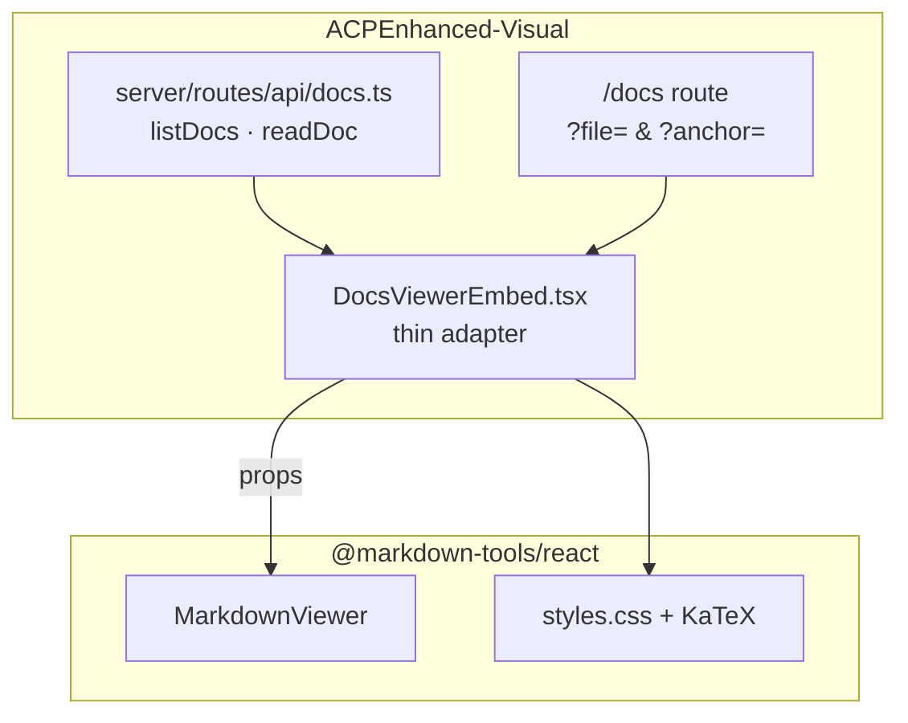

# ACPEnhanced-Visual Migration Guide

**Package**: `@markdown-tools/react` **^0.4.2**  
**Status**: Migration executes in **ACPEnhanced-Visual** repo (not this repo)  
**Strategy**: [ADR-006](../agent/memory/decisions.md) — visualizer keeps server `listDocs` / `readDoc`; markdown-tools is the **viewer plugin** (render, Mermaid, KaTeX, export).

---

## Table of contents

1. [Architecture](#architecture)
2. [Prerequisites](#prerequisites)
3. [Install the package](#install-the-package)
4. [Create the embed wrapper](#create-the-embed-wrapper)
5. [Wire the route](#wire-the-route)
6. [Theme sync (ADR-007)](#theme-sync-adr-007)
7. [Deep links and SourceLink](#deep-links-and-sourcelink)
8. [Remove legacy DocsViewer](#remove-legacy-docsviewer)
9. [Verification checklist](#verification-checklist)
10. [Testing](#testing)
11. [Troubleshooting](#troubleshooting)
12. [Upgrade policy](#upgrade-policy)

---

## Architecture

Markdown-tools does **not** replace your server or router. It replaces **only** the in-repo `DocsViewer.tsx` UI.



| Your responsibility (visualizer) | Package responsibility |
|----------------------------------|------------------------|
| `listDocs()` → `DocFile[]` | Sidebar from `files` prop |
| `readDoc(path)` → markdown string | Parse, sanitize, Mermaid, KaTeX |
| Router search `file`, `anchor` | `initialFile`, `initialAnchor`, scroll |
| App shell theme / navigation | `theme`, `onThemeChange`, `showSidebar` |
| Error boundary around route (recommended) | `MarkdownViewerWithBoundary` export |

**Do not** move `listDocs` / `readDoc` into the package (FR-7.3).  
**Do not** use standalone folder browser (`onOpenFolder`) in visualizer — that is for the markdown-tools SPA only.

---

## Prerequisites

| Requirement | Notes |
|-------------|--------|
| **React 19** | Peer dependency `^19.0.0` |
| **markdown-tools v0.4.1+** | E2E-stable embed API, `build:lib` fixed |
| **Server routes unchanged** | `server/routes/api/docs.ts` stays in visualizer |
| **TanStack Router** | Existing `/docs` search params `file`, `anchor` |

Before cutover, confirm markdown-tools passes its quality gate:

```bash
# In markdown-tools repo
npm test && npm run build:lib && npm pack --dry-run
```

---

## Install the package

### Option A — npm registry (after publish)

```bash
cd ACPEnhanced-Visual
npm install @markdown-tools/react@^0.4.1 react react-dom
```

### Option B — local development (before publish)

Link the library from your markdown-tools clone:

```bash
# markdown-tools repo
npm run build:lib
npm link

# ACPEnhanced-Visual repo
npm link @markdown-tools/react
```

Or use a `file:` dependency in visualizer `package.json`:

```json
{
  "dependencies": {
    "@markdown-tools/react": "file:../Markdown-tools"
  }
}
```

Run `npm run build:lib` in markdown-tools after every library change.

---

## Create the embed wrapper

Create `src/components/DocsViewerEmbed.tsx` — a **thin adapter** between your server API and `MarkdownViewer`.

```tsx
import { useCallback, useEffect, useState } from 'react'
import { useNavigate, useSearch } from '@tanstack/react-router'
import {
  MarkdownViewerWithBoundary,
  parseDocsSearchParams,
  buildDocsSearchParams,
  type DocFile,
} from '@markdown-tools/react'
import '@markdown-tools/react/styles.css'
import { listDocs, readDoc } from '@/server/routes/api/docs'

type Theme = 'light' | 'dark'

interface DocsViewerEmbedProps {
  /** Sync with visualizer shell theme (ADR-007). Omit for internal toggle. */
  theme?: Theme
  onThemeChange?: (theme: Theme) => void
}

export function DocsViewerEmbed({ theme, onThemeChange }: DocsViewerEmbedProps) {
  const search = useSearch({ from: '/docs' })
  const navigate = useNavigate({ from: '/docs' })
  const { file, anchor } = parseDocsSearchParams(
    new URLSearchParams(search as Record<string, string>),
  )

  const [files, setFiles] = useState<DocFile[]>([])
  const [content, setContent] = useState('')
  const [activePath, setActivePath] = useState<string | null>(file ?? null)
  const [loading, setLoading] = useState(true)

  // Load sidebar file list once
  useEffect(() => {
    listDocs()
      .then(setFiles)
      .finally(() => setLoading(false))
  }, [])

  // Sync URL → active document when deep-link or browser back/forward
  useEffect(() => {
    if (!file) return
    setActivePath(file)
    readDoc({ data: { path: file } })
      .then(setContent)
      .catch(() => setContent(''))
  }, [file])

  const loadPath = useCallback(
    async (path: string, nextAnchor?: string) => {
      setActivePath(path)
      const text = await readDoc({ data: { path } })
      setContent(text)
      navigate({
        search: (prev) => ({
          ...prev,
          ...Object.fromEntries(
            new URLSearchParams(buildDocsSearchParams(path, nextAnchor)).entries(),
          ),
        }),
      })
    },
    [navigate],
  )

  return (
    <MarkdownViewerWithBoundary
      content={content}
      documentPath={activePath}
      files={files}
      showSidebar
      loading={loading}
      theme={theme}
      onThemeChange={onThemeChange}
      initialFile={file}
      initialAnchor={anchor}
      onSelectFile={(path) => void loadPath(path)}
    />
  )
}
```

### Important integration rules

1. **`documentPath` must update on sidebar click** — not only `content`. The example uses `activePath` + router navigation so export filenames and sidebar selection stay correct.

2. **Controlled `content` is correct for embed** — you always pass server-loaded markdown. Unlike standalone mode, passing `content=""` before the first load is expected; toolbar appears once content has length.

3. **Use `MarkdownViewerWithBoundary`** — wraps `ErrorBoundary` so one bad document does not crash the visualizer shell.

4. **CSS import is required** — without `@markdown-tools/react/styles.css`, KaTeX and prose styles are missing.

5. **`initialFile` + `onSelectFile`** — on first mount with `?file=`, the viewer calls `onSelectFile(initialFile)` once. Your handler must load content (the `useEffect` on `file` above also covers URL-driven loads).

---

## Wire the route

Update `src/routes/docs.tsx` (paths may vary):

```tsx
import { DocsViewerEmbed } from '@/components/DocsViewerEmbed'
import { useTheme } from '@/hooks/useTheme' // your shell hook

export function DocsRoute() {
  const { theme, setTheme } = useTheme()
  return <DocsViewerEmbed theme={theme} onThemeChange={setTheme} />
}
```

Replace `<DocsViewer />` with `<DocsViewerEmbed />`. Keep route search schema:

```ts
// Example search validation
validateSearch: (search) => ({
  file: typeof search.file === 'string' ? search.file : undefined,
  anchor: typeof search.anchor === 'string' ? search.anchor : undefined,
})
```

---

## Theme sync (ADR-007)

If the visualizer shell controls dark mode, pass **both** `theme` and `onThemeChange`. The viewer toolbar toggle will call `onThemeChange` instead of internal state.

If you omit `theme`, the viewer manages its own light/dark toggle (usually wrong inside a themed shell).

```tsx
<DocsViewerEmbed theme={shellTheme} onThemeChange={setShellTheme} />
```

Persist theme in your existing visualizer preference store (localStorage, user settings, etc.).

---

## Deep links and SourceLink

URL contract (unchanged from legacy DocsViewer):

| Query param | Prop | Example |
|-------------|------|---------|
| `file` | `initialFile` / router state | `?file=agent/design/requirements.md` |
| `anchor` | `initialAnchor` | `&anchor=fr-7` |

Helpers exported from the package:

```tsx
import { parseDocsSearchParams, buildDocsSearchParams } from '@markdown-tools/react'

// Read
const { file, anchor } = parseDocsSearchParams(location.search)

// Write (SourceLink navigation)
const qs = buildDocsSearchParams('docs/sample-basic.md', 'intro')
navigate({ to: '/docs', search: Object.fromEntries(new URLSearchParams(qs)) })
```

---

## Remove legacy DocsViewer

After parity verification:

1. Delete `src/components/DocsViewer.tsx`
2. Remove unused viewer-only CSS imports that duplicated `prose-doc.css`
3. Remove vendored `svg-to-png` / mermaid helpers if they only served DocsViewer
4. Update `test/components/docs-viewer.test.tsx` to test `DocsViewerEmbed` (mock `@markdown-tools/react` or integration-test with real package)

**Keep** `server/routes/api/docs.ts` — the package has no server.

---

## Verification checklist

Run in ACPEnhanced-Visual after integration:

| # | Check | Pass? |
|---|--------|-------|
| 1 | `/docs` loads file list in sidebar | ☐ |
| 2 | Clicking sidebar entry loads document | ☐ |
| 3 | `?file=...&anchor=...` deep-link scrolls to heading | ☐ |
| 4 | SourceLink from other tabs opens correct doc + anchor | ☐ |
| 5 | Mermaid diagrams render; click-to-zoom works | ☐ |
| 6 | KaTeX math renders (try a doc with `$...$`) | ☐ |
| 7 | Export Word / DOCX / PDF from toolbar | ☐ |
| 8 | Theme toggle syncs with visualizer shell | ☐ |
| 9 | View source (`</>`) shows raw markdown | ☐ |
| 10 | Invalid drop shows toast (if DnD enabled in embed) | ☐ |
| 11 | No duplicate viewer CSS; layout matches shell | ☐ |

Sample fixtures to copy from markdown-tools `docs/` for smoke tests: `sample-basic.md`, `sample-mermaid.md`, `sample-math.md`.

---

## Testing

### In markdown-tools (contract API)

```bash
npm test -- test/contract/props-contract.test.ts
```

This guards `MarkdownViewerProps` and `DocFile` shape — CI fails if embed API drifts without semver bump.

### In ACPEnhanced-Visual

1. **Unit** — mock `readDoc` / `listDocs`; assert wrapper passes expected props
2. **Integration** — link local `@markdown-tools/react`; open `/docs?file=...`
3. **Regression** — compare export output and Mermaid render against legacy DocsViewer on `sample-export-torture.md`

---

## Troubleshooting

| Problem | Solution |
|---------|----------|
| Unstyled math / plain text formulas | Import `@markdown-tools/react/styles.css` once in embed entry |
| Theme toggle does nothing | Pass `onThemeChange` when `theme` prop is set (ADR-007) |
| Toolbar hidden despite loaded doc | Ensure `content` has length after `readDoc` resolves |
| Sidebar click loads content but export name wrong | Update `documentPath` / `activePath` on `onSelectFile`, not only `content` |
| `listDocs` shape error | `DocFile` requires `{ name, path, dir }` — see contract test |
| Package not found | Use `npm link` or `file:` until `npm publish` |
| Mermaid blank on first paint | Wait for render; theme change re-runs mermaid |
| Build errors on React version | Upgrade visualizer to React 19 peers |

---

## Upgrade policy

| markdown-tools version | Action for visualizer |
|------------------------|------------------------|
| **0.4.x patch** | Safe — bug fixes, doc updates |
| **0.5.0 minor** | Read CHANGELOG; run contract tests |
| **1.0.0 major** | Full regression checklist; props may break |

Pin `"@markdown-tools/react": "^0.4.1"` until you validate newer releases.

---

## Related documentation

| Doc | Purpose |
|-----|---------|
| [embed-api.md](./embed-api.md) | Full props reference |
| [agent/design/requirements.md](../agent/design/requirements.md) FR-7 | Formal embed requirements |
| [agent/memory/decisions.md](../agent/memory/decisions.md) ADR-006, ADR-007 | Architecture decisions |
| [agent/reports/audit-6-visualizer-migration.md](../agent/reports/audit-6-visualizer-migration.md) | Audit of this guide |

**Questions / issues**: open an issue on [markdown-tools](https://github.com/ssucipto/markdown-tools) with visualizer version, `@markdown-tools/react` version, and reproduction route.
